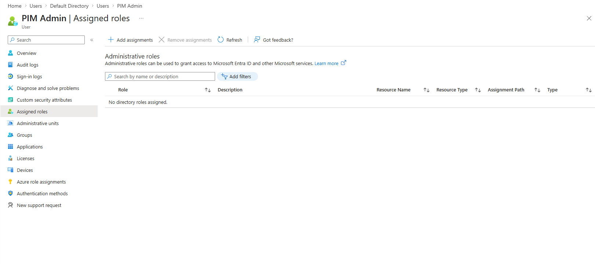
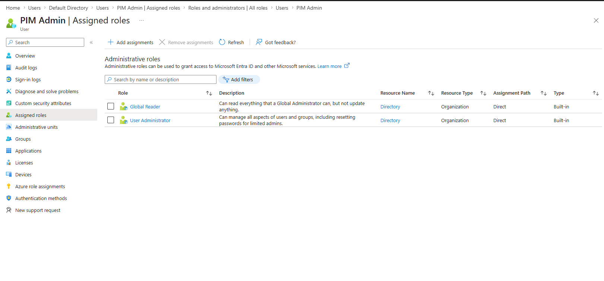
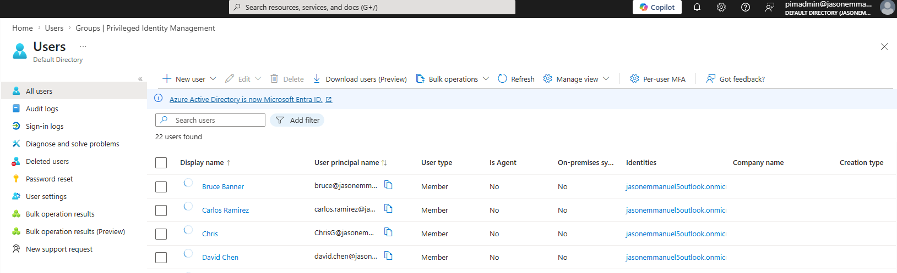
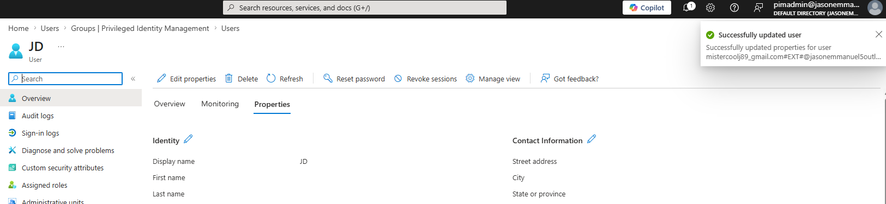
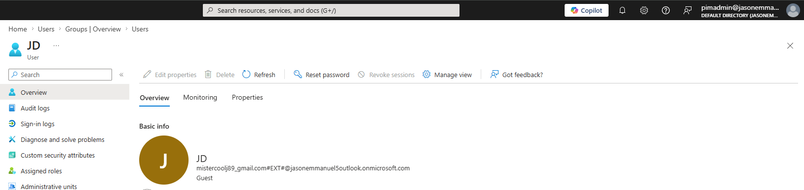
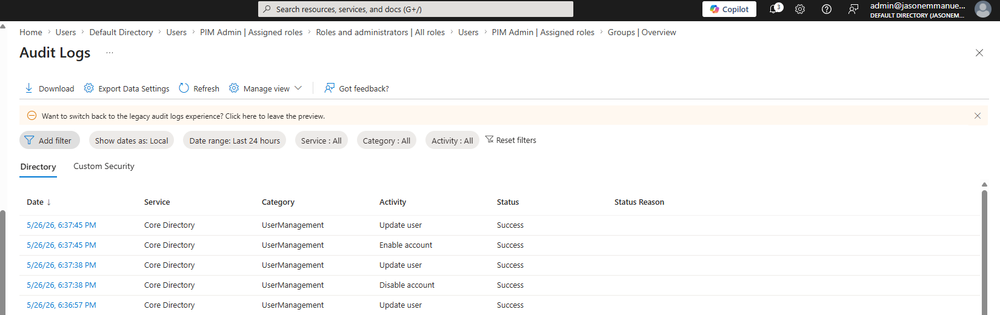

# Project – PAM Capstone: Privileged Access Management with Microsoft Entra PIM

---

# Overview

This project demonstrates Privileged Access Management (PAM) using Microsoft Entra Privileged Identity Management (PIM).

The lab focused on implementing Just-In-Time (JIT) privileged access controls by assigning eligible administrative roles instead of permanent standing privileges.

The project simulated how enterprise IAM teams secure elevated access using:

- Temporary privilege elevation
- MFA enforcement
- Activation justification
- Time-limited privileged sessions
- Audit logging and monitoring

---

# Environment

| Tool | Purpose |
|------|---------|
| Microsoft Entra PIM | Just-In-Time privileged access |
| Microsoft Entra ID | Identity platform |
| Azure Audit Logs | Privileged activity monitoring |
| Azure Portal | Administrative configuration |
| Microsoft Authenticator | MFA verification |
| GitHub | Documentation and evidence tracking |

---

# Dedicated Privileged Administrator Account

A separate privileged administrator account was created to isolate elevated administrative activity from standard day-to-day user operations.

This follows a core PAM security principle:

> Administrative identities should remain separate from standard user identities.

Before role assignment, the privileged account had no directory roles assigned.

*Privileged administrator account before role assignment*

After configuration, administrative roles were assigned to support privileged access testing and role activation workflows.

*Privileged administrator account after role assignment*

---

# Privileged Access Environment

Multiple users and administrative accounts were provisioned inside the Microsoft Entra ID tenant to simulate an enterprise identity environment.

The environment included:

- Standard user accounts
- Administrative identities
- Department-based identities
- External guest identities
- Role assignment testing

*Microsoft Entra ID tenant showing provisioned users and privileged accounts*

---

# Guest Identity Federation Validation

An external guest identity was configured and updated inside the tenant to simulate external collaboration workflows.

The guest account was successfully updated and validated inside Microsoft Entra ID.

*Guest user successfully updated inside Microsoft Entra ID*

The external guest identity was then validated inside the tenant directory.

*External guest identity successfully provisioned inside Microsoft Entra ID*

---

# Audit Logging and Monitoring Scenario

Azure Audit Logs were reviewed to validate privileged identity activity and user management events occurring inside the tenant.

Audit logs captured:

- User updates
- Account enable/disable actions
- Administrative modifications
- Identity management operations

This simulated enterprise audit review and compliance monitoring workflows.

*Azure Audit Logs showing privileged identity management activity*

---

# Controls Implemented

| Control | Purpose |
|---|---|
| Separate Admin Account | Reduced exposure of privileged credentials |
| Role-Based Access Control (RBAC) | Restricted permissions based on administrative responsibility |
| MFA Enforcement | Added secondary verification before privileged access |
| Audit Logging | Captured identity management activity |
| Least Privilege | Limited administrative access to required actions only |
| Identity Segmentation | Separated privileged and standard identities |

---

# Skills Demonstrated

| Skill | Application |
|---|---|
| Privileged Access Management (PAM) | Managed elevated administrative access |
| Microsoft Entra ID | Configured identities and administrative roles |
| RBAC | Applied role-based administrative permissions |
| Identity Governance | Controlled privileged administrative workflows |
| Audit Monitoring | Reviewed Azure audit logs |
| Guest Identity Management | Managed external guest accounts |
| IAM Documentation | Captured evidence-backed workflows |
| Zero Trust Concepts | Reduced standing privileged access exposure |

---

# Lessons Learned

Privileged identities represent one of the highest-value attack targets in enterprise environments.

Separating privileged accounts from standard user activity significantly reduces exposure risk and improves administrative accountability.

Audit logging plays a critical role in privileged identity management because every administrative action must remain traceable for both security investigations and compliance validation.

This project also reinforced how identity governance extends beyond internal users and includes secure management of external guest identities and federated access scenarios.

---

# References

Microsoft Entra Privileged Identity Management Documentation  
https://learn.microsoft.com/en-us/entra/id-governance/privileged-identity-management/

Azure Audit Logs Overview  
https://learn.microsoft.com/en-us/azure/azure-monitor/platform/activity-log

Microsoft Entra ID Documentation  
https://learn.microsoft.com/en-us/entra/

Zero Trust Security Principles  
https://learn.microsoft.com/en-us/security/zero-trust/
